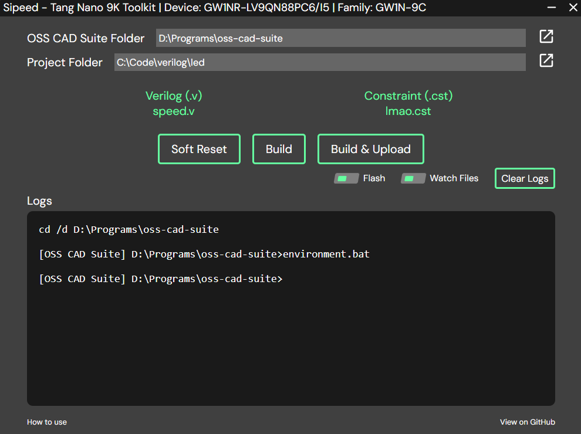

# Prerequisites
- Obtain a [Tang Nano 9K](https://wiki.sipeed.com/hardware/en/tang/Tang-Nano-9K/Nano-9K.html) dev board.
- Connect it to your machine and install its driver using [Zadig](https://zadig.akeo.ie/) on **JTAG Interface 0**.
- Install the [OSS CAD Suite](https://github.com/YosysHQ/oss-cad-suite-build/) build tool.
- Obtain/Write working verilog (.v) and constraints (.cst) files.

# Installing the app
- Go to [releases](https://github.com/biologyscience/fpga-toolkit/releases) and download the .zip file (not the source code).
- Extract it wherever you like the app to be.
- Open the app (woah genius 🫨)

# How to use

Does it look straight forward? You might be here for a reason, follow along.

- Select the folder at which you have extracted the OSS CAD Suite build tools by clicking the button across the "OSS CAD Suite Folder".
- Select the folder where you have a verilog (.v) and a constraint (.cst) file in the same directory by entering the path beside "Project Folder" or by clicking the button nearby.
  - If both .v and .cst files exists at the provided directory, their file names will be displayed in green as shown.
  - If files are missing they will turn red.
- Time to plug your dev board to your machine.
- Once plugged, click "Build & Upload" to upload the generated bitstream (.fs) file to your board.
  - Optionally click "Build" if you just want to generate the .fs file without uploading it.
  - You can monitor on what's happening in the "Logs" box.
- Yay 🥳

#### Would you like some additional features for no extra cost?
- **Soft Reset**: Clicking this is equivalent to performing a power-cycle. Data store in board's SRAM will be cleared.
- **Flash**: Enabling this will load the bitstream to the flash memory which will survive power-cycles. Uploading into flash takes more time than uploading into SRAM.
- **Watch Files**: When enabled, a change in .v or .cst file will trigger a build and a fresh bitstream will be uploaded. Feature inspired from [nodemon](https://github.com/remy/nodemon).
- **Clear Logs**: Self explanatory. Action cannot be undone btw.

---

> Still need help? Check [FAQ](FAQ.md).

I may not be great in providing the best steps. [Feel free to suggest a better version of this page](https://github.com/biologyscience/fpga-toolkit/edit/main/info/GET-STARTED.md).